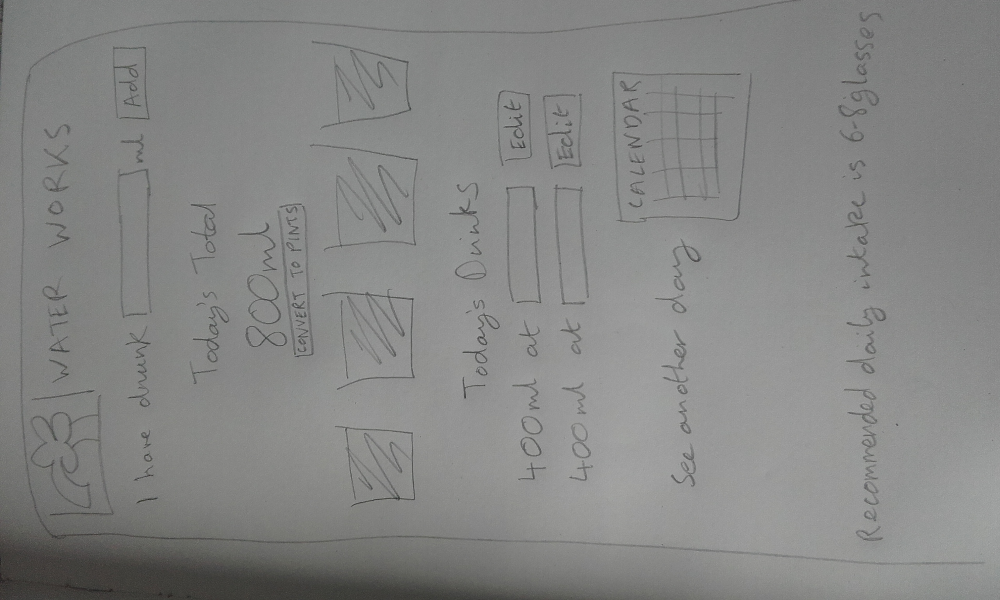
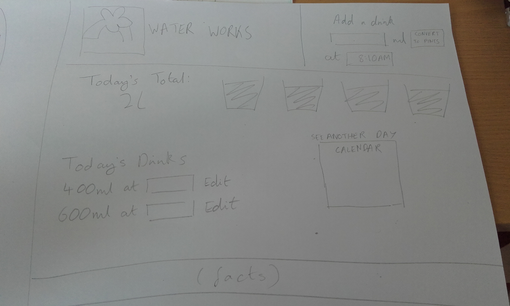

# Water Works

An app built with React/Redux, to the following specifications:
- Allow the user to log when and how much water they have consumed
- Allow the user to view how much water they have consumed on the current day

Nice to have:

- Allow the user to view how much water they have consumed on previous days


## To run this app

Required: yarn, vagrant, command line tool.

1. In the command line, run ```git clone git@github.com:KateHoward10/water-api.git```
2. Navigate into water-api/
3. Run ```vagrant up```
4. In another terminal window run ```git clone git@github.com:KateHoward10/water-works.git```
5. Navigate into water-works/
6. Run ```yarn``` and ```yarn start```


## Initial thoughts

I started off by making some rough wireframes (see below) and coming up with features I'd like the app to include:
- the ability to edit the amount and time of each drink (user might have entered the amount incorrectly/inaccurately, or had the drink some time ago)
- daily total visualised with stylised water glasses, or maybe just blue blobs
- list of drinks separated into days, with user able to select one day at a time
- facts about water intake in the footer, maybe changing randomly on page reload




## Progress

Having rustled up the basic structure of the app, which retained amounts and times in its state, I set about using Laravel to build an API, which would persist the data and allow the user to look back on previous days.

I also shared my designs and ideas with some friends, who seemed to approve of all the features I had come up with, and also suggested being able to set a target (or even calculate how much water to aim for) and having some sort of visualisation of progress towards this target.

In the end, rather than taking in time and amount for each drink, and allowing both to be editted, for simplicity my API only included amount. I set it up to allow put and delete requests as well as get and post, so the amount could be editted.

Once the API was working with the app, I started implementing the features I originally came up with, and worked on styling. I designed this app to be mobile first, and with the functionality on its way I made it responsive, rearranging the layout at larger screen sizes so that all the elements could be seen without scrolling, but without making it look too busy and confusing.

Apart from the ability to edit the time of a drink I managed to get all my planned features working, including a target visualisation, which fills up with 'water' in proportion to the total amount for the day. The default target is 2l, which I'm told is the recommended intake, but as this varies between different people I added the ability to edit it.

Next I asked a few people to try out the app. Suggestions included:
- instructions above the input to make it clear that was the place to start (added "Record your drink here", which I think gets this across succinctly)
- keeping "ml" beside the input for a drink in the list when it goes into edit mode - someone typed in "ml" after their editted amount which made it invalid
- making sure negative numbers could not be entered (updated the API to allow integers with a minimum of 0). This idea also prompted me to change input types from "text" to "number" to avoid invalid entries

My original designs included a button to convert amounts to pints, but I did not manage to implement this. I think it would have to convert everything in the app, including previous amounts, so those would need a "units" property to keep track of what they were set to when recorded. It would be an interesting challenge to work on with a bit more time.
